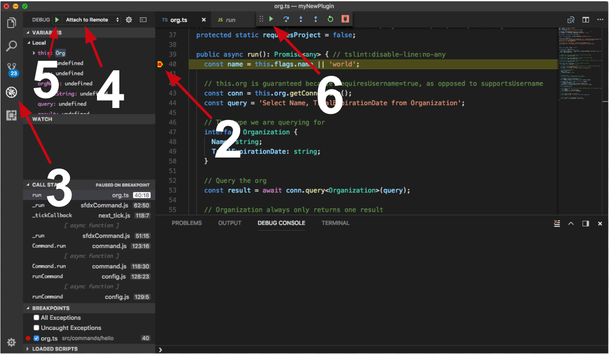

# Custom Metadata Plugin

Tools for working with custom metadata types and their records.

[](https://www.npmjs.com/package/@salesforce/plugin-custom-metadata)
[](https://github.com/salesforcecli/plugin-custom-metadata/blob/master/LICENSE.txt)

This plugin is bundled with the [Salesforce CLI](https://developer.salesforce.com/tools/sfdxcli). For more information on the CLI, read the [getting started guide](https://developer.salesforce.com/docs/atlas.en-us.sfdx_setup.meta/sfdx_setup/sfdx_setup_intro.htm).

We always recommend using the latest version of these commands bundled with the CLI, however, you can install a specific version or tag if needed.

## Install

```bash
sfdx plugins install custom-metadata@x.y.z
```

## Issues

Please report any issues at <https://github.com/forcedotcom/cli/issues>

## Contributing

1. Please read our [Code of Conduct](CODE_OF_CONDUCT.md)
2. Create a new issue before starting your project so that we can keep track of
   what you are trying to add/fix. That way, we can also offer suggestions or
   let you know if there is already an effort in progress.
3. Fork this repository.
4. [Build the plugin locally](#build)
5. Create a _topic_ branch in your fork. Note, this step is recommended but technically not required if contributing using a fork.
6. Edit the code in your fork.
7. Write appropriate tests for your changes. Try to achieve at least 95% code coverage on any new code. No pull request will be accepted without unit tests.
8. Sign CLA (see [CLA](#cla) below).
9. Send us a pull request when you are done. We'll review your code, suggest any needed changes, and merge it in.

### CLA

External contributors will be required to sign a Contributor's License
Agreement. You can do so by going to <https://cla.salesforce.com/sign-cla>.

### Build

To build the plugin locally, make sure to have yarn installed and run the following commands:

```bash
# Clone the repository
git clone git@github.com:salesforcecli/plugin-custom-metadata

# Install the dependencies and compile
yarn install
yarn build
```

To use your plugin, run using the local `./bin/dev` or `./bin/dev.cmd` file.

```bash
# Run using local run file.
./bin/dev force:cmdt
```

There should be no differences when running via the Salesforce CLI or using the local run file. However, it can be useful to link the plugin to do some additional testing or run your commands from anywhere on your machine.

```bash
# Link your plugin to the sfdx cli
sfdx plugins:link .
# To verify
sfdx plugins
```

# Commands

<!-- commands -->

- [`sf cmdt generate field`](#sf-cmdt-generate-field)
- [`sf cmdt generate fromorg`](#sf-cmdt-generate-fromorg)
- [`sf cmdt generate object`](#sf-cmdt-generate-object)
- [`sf cmdt generate record`](#sf-cmdt-generate-record)
- [`sf cmdt generate records`](#sf-cmdt-generate-records)

## `sf cmdt generate field`

Generate a field for a custom metadata type based on the provided field type.

```
USAGE
  $ sf cmdt generate field -n <value> -f
    Checkbox|Date|DateTime|Email|Number|Percent|Phone|Picklist|Text|TextArea|LongTextArea|Url [--json] [-p <value>] [-s
    <value>] [-l <value>] [-d <value>]

FLAGS
  -d, --output-directory=<value>    Directory to store newly-created field definition files.
  -f, --type=<option>               (required) Type of the field.
                                    <options: Checkbox|Date|DateTime|Email|Number|Percent|Phone|Picklist|Text|TextArea|L
                                    ongTextArea|Url>
  -l, --label=<value>               Label for the field.
  -n, --name=<value>                (required) Unique name for the field.
  -p, --picklist-values=<value>...  Picklist values; required for picklist fields.
  -s, --decimal-places=<value>      Number of decimal places to use for number or percent fields.

GLOBAL FLAGS
  --json  Format output as json.

DESCRIPTION
  Generate a field for a custom metadata type based on the provided field type.

  Similar to a custom object, a custom metadata type has a list of custom fields that represent aspects of the metadata.

  This command creates a metadata file that describes the new custom metadata type field. By default, the file is
  created in a "fields" directory in the current directory. Use the --output-directory to generate the file in the
  directory that contains the custom metadata type metdata files, such as "force-app/main/default/objects/MyCmdt__mdt"
  for the custom metadata type called MyCmdt.

ALIASES
  $ sf force cmdt field create
  $ sf cmdt field create

EXAMPLES
  Generate a metadata file for a custom checkbox field and add the file to the MyCmdt__mdt/fields directory:

    $ sf cmdt generate field --name MyCheckboxField --type Checkbox --output-directory \
      force-app/main/default/objects/MyCmdt__mdt

  Generate a metadata file for a custom picklist field and add a few values:

    $ sf cmdt generate field --name MyPicklistField --type Picklist --picklist-values A --picklist-values B \
      --picklist-values C --output-directory force-app/main/default/objects/MyCmdt__mdt

  Generate a metadata file for a custom number field and specify 2 decimal places:

    $ sf cmdt generate field --name MyNumberField --type Number --decimal-places 2 --output-directory \
      force-app/main/default/objects/MyCmdt__mdt

FLAG DESCRIPTIONS
  -d, --output-directory=<value>  Directory to store newly-created field definition files.

    New files are automatically created in the "fields" directory. The location can be an absolute path or relative to
    the current working directory. The default is the current directory.

  -f, --type=Checkbox|Date|DateTime|Email|Number|Percent|Phone|Picklist|Text|TextArea|LongTextArea|Url

    Type of the field.

    You can't use this command to create a custom metadata type field of type "Metadata Relationship". Use the
    Salesforce Setup UI instead.

  -s, --decimal-places=<value>  Number of decimal places to use for number or percent fields.

    The value must be greater than or equal to zero. Default value is 0.
```

_See code: [src/commands/cmdt/generate/field.ts](https://github.com/salesforcecli/plugin-custom-metadata/blob/3.0.2/src/commands/cmdt/generate/field.ts)_

## `sf cmdt generate fromorg`

Generate a custom metadata type and all its records from a Salesforce object.

```
USAGE
  $ sf cmdt generate fromorg -o <value> -n <value> -s <value> [--json] [--api-version <value>] [-l <value>] [-p <value>]
    [-v PackageProtected|Protected|Public] [-i] [-d <value>] [-r <value>]

FLAGS
  -d, --type-output-directory=<value>  [default: force-app/main/default/objects] Directory to store newly-created custom
                                       metadata type files.
  -i, --ignore-unsupported             Ignore unsupported field types.
  -l, --label=<value>                  Label for the custom metadata type.
  -n, --dev-name=<value>               (required) Name of the custom metadata type.
  -o, --target-org=<value>             (required) Username or alias of the target org.
  -p, --plural-label=<value>           Plural version of the label value; if blank, uses label.
  -r, --records-output-dir=<value>     [default: force-app/main/default/customMetadata] Directory to store newly-created
                                       custom metadata record files.
  -s, --sobject=<value>                (required) API name of the source Salesforce object used to generate the custom
                                       metadata type.
  -v, --visibility=<option>            [default: Public] Who can see the custom metadata type.
                                       <options: PackageProtected|Protected|Public>
      --api-version=<value>            Override the api version used for api requests made by this command

GLOBAL FLAGS
  --json  Format output as json.

DESCRIPTION
  Generate a custom metadata type and all its records from a Salesforce object.

  Use this command to migrate existing custom objects or custom settings in an org to custom metadata types. If a field
  of the Salesforce object is of an unsupported type, the field type is automatically converted to text. Run "sf cmdt
  generate field --help" to see the list of supported cmdt field types, listed in the --type flag summary. Use the
  --ignore-unsupported to ignore these fields.

  This command creates the metadata files that describe the new custom metadata type and its fields in the
  "force-app/main/default/objects/TypeName__mdt" directory by default, where "TypeName" is the value of the required
  --dev-name flag. Use --type-output-directory to create them in a different directory.

ALIASES
  $ sf force cmdt generate

EXAMPLES
  Generate a custom metadata type from a custom object called MySourceObject__c in your default org:

    $ sf cmdt generate fromorg --dev-name MyCMDT --sobject MySourceObject__c

  Generate a custom metadata type from a custom object in an org with alias my-scratch-org; ignore unsupported field
  types instead of converting them to text:

    $ sf cmdt generate fromorg --dev-name MyCMDT --sobject MySourceObject__c --ignore-unsupported --target-org \
      my-scratch-org

  Generate a protected custom metadata type from a custom object:

    $ sf cmdt generate fromorg --dev-name MyCMDT --sobject MySourceObject__c --visibility Protected

  Generate a protected custom metadata type from a custom setting with a specific singular and plural label:

    $ sf cmdt generate fromorg --dev-name MyCMDT --label "My CMDT" --plural-label "My CMDTs" --sobject \
      MySourceSetting__c --visibility Protected

  Generate a custom metadata type and put the resulting metadata files in the specified directory:

    $ sf cmdt generate fromorg --dev-name MyCMDT --sobject MySourceObject__c --type-output-directory \
      path/to/my/cmdt/directory

  Generate a custom metadata type and put the resulting record metadata file(s) in the specified directory:

    $ sf cmdt generate fromorg --dev-name MyCMDT --sobject MySourceObject__c --records-output-dir \
      path/to/my/cmdt/record/directory

FLAG DESCRIPTIONS
  -i, --ignore-unsupported  Ignore unsupported field types.

    In this context, "ignore" means that the fields aren't created. The default behavior is to create fields of type
    text and convert the field values to text.

  -v, --visibility=PackageProtected|Protected|Public  Who can see the custom metadata type.

    For more information on what each option means, see this topic in Salesforce Help:
    https://help.salesforce.com/s/articleView?id=sf.custommetadatatypes_ui_create.htm&type=5.
```

_See code: [src/commands/cmdt/generate/fromorg.ts](https://github.com/salesforcecli/plugin-custom-metadata/blob/3.0.2/src/commands/cmdt/generate/fromorg.ts)_

## `sf cmdt generate object`

Generate a new custom metadata type in the current project.

```
USAGE
  $ sf cmdt generate object -n <value> [--json] [-l <value>] [-p <value>] [-v PackageProtected|Protected|Public] [-d
    <value>]

FLAGS
  -d, --output-directory=<value>  Directory to store the newly-created custom metadata type files
  -l, --label=<value>             Label for the custom metadata type.
  -n, --type-name=<value>         (required) Unique object name for the custom metadata type.
  -p, --plural-label=<value>      Plural version of the label value; if blank, uses label.
  -v, --visibility=<option>       [default: Public] Who can see the custom metadata type.
                                  <options: PackageProtected|Protected|Public>

GLOBAL FLAGS
  --json  Format output as json.

DESCRIPTION
  Generate a new custom metadata type in the current project.

  This command creates a metadata file that describes the new custom metadata type. By default, the file is created in
  the MyCustomType__mdt directory in the current directory, where MyCustomType is the value of the required --type-name
  flag. Use the --output-directory to generate the file in a package directory with other custom metadata types, such as
  "force-app/main/default/objects".

ALIASES
  $ sf force cmdt create
  $ sf cmdt create

EXAMPLES
  Generate a custom metadata type with developer name 'MyCustomType'; this name is also used as the label:

    $ sf cmdt generate object --type-name MyCustomType

  Generate a protected custom metadata type with a specific label:

    $ sf cmdt generate object --type-name MyCustomType --label "Custom Type" --plural-label "Custom Types" \
      --visibility Protected

FLAG DESCRIPTIONS
  -d, --output-directory=<value>  Directory to store the newly-created custom metadata type files

    The location can be an absolute path or relative to the current working directory. The default is the current
    directory.

  -n, --type-name=<value>  Unique object name for the custom metadata type.

    The name can contain only underscores and alphanumeric characters, and must be unique in your org. It must begin
    with a letter, not include spaces, not end with an underscore, and not contain two consecutive underscores.

  -v, --visibility=PackageProtected|Protected|Public  Who can see the custom metadata type.

    For more information on what each option means, see this topic in Salesforce Help:
    https://help.salesforce.com/s/articleView?id=sf.custommetadatatypes_ui_create.htm&type=5.
```

_See code: [src/commands/cmdt/generate/object.ts](https://github.com/salesforcecli/plugin-custom-metadata/blob/3.0.2/src/commands/cmdt/generate/object.ts)_

## `sf cmdt generate record`

Generate a new record for a given custom metadata type in the current project.

```
USAGE
  $ sf cmdt generate record -t <value> -n <value> [--json] [-l <value>] [-p true|false] [-i <value>] [-d <value>]

FLAGS
  -d, --output-directory=<value>  [default: force-app/main/default/customMetadata] Directory to store newly-created
                                  custom metadata record files.
  -i, --input-directory=<value>   [default: force-app/main/default/objects] Directory from which to get the custom
                                  metadata type definition from.
  -l, --label=<value>             Label for the new record.
  -n, --record-name=<value>       (required) Name of the new record.
  -p, --protected=<option>        [default: false] Protect the record when it's in a managed package.
                                  <options: true|false>
  -t, --type-name=<value>         (required) API name of the custom metadata type to create a record for; must end in
                                  "__mdt".

GLOBAL FLAGS
  --json  Format output as json.

DESCRIPTION
  Generate a new record for a given custom metadata type in the current project.

  The custom metadata type must already exist in your project. You must specify a name for the new record. Use
  name=value pairs to specify the values for the fields, such as MyTextField="some text here" or MyNumberField=32.

ALIASES
  $ sf force cmdt record create
  $ sf cmdt record create

EXAMPLES
  Create a record metadata file for custom metadata type 'MyCMT' with specified values for two custom fields:

    $ sf cmdt generate record --type-name MyCMT__mdt --record-name MyRecord My_Custom_Field_1=Foo \
      My_Custom_Field_2=Bar

  Create a protected record metadata file for custom metadata type 'MyCMT' with a specific label and values specified
  for two custom fields:

    $ sf cmdt generate record --type-name MyCMT__mdt --record-name MyRecord --label "My Record" --protected true \
      My_Custom_Field_1=Foo My_Custom_Field_2=Bar

FLAG DESCRIPTIONS
  -p, --protected=true|false  Protect the record when it's in a managed package.

    Protected records can only be accessed by code in the same managed package namespace.
```

_See code: [src/commands/cmdt/generate/record.ts](https://github.com/salesforcecli/plugin-custom-metadata/blob/3.0.2/src/commands/cmdt/generate/record.ts)_

## `sf cmdt generate records`

Generate new custom metadata type records from a CSV file.

```
USAGE
  $ sf cmdt generate records -f <value> -t <value> [--json] [-i <value>] [-d <value>] [-n <value>]

FLAGS
  -d, --output-directory=<value>  [default: force-app/main/default/customMetadata] Directory to store newly-created
                                  custom metadata record files.
  -f, --csv=<value>               (required) Pathname of the CSV file.
  -i, --input-directory=<value>   [default: force-app/main/default/objects] Directory from which to get the custom
                                  metadata type definition from.
  -n, --name-column=<value>       [default: Name] Column used to determine the name of the record.
  -t, --type-name=<value>         (required) API name of the custom metadata type to create a record for.

GLOBAL FLAGS
  --json  Format output as json.

DESCRIPTION
  Generate new custom metadata type records from a CSV file.

  The custom metadata type must already exist in your project. By default, the Name column is used to determine the
  record name; use the --name-column flag to specify a different column.

ALIASES
  $ sf force cmdt record insert
  $ sf cmdt record insert

EXAMPLES
  Generate record metadata files from values in a CSV file for the custom metadata type MyCmdt. Use 'Name' as the
  column that specifies the record name:

    $ sf cmdt generate records --csv path/to/my.csv --type-name MyCmdt

  Generate record metadata files from a CSV file in the directory different from the default, and use 'PrimaryKey' as
  the column that specifies the record name:

    $ sf cmdt generate records --csv path/to/my.csv --type-name MyCmdt --input-directory path/to/my/cmdt/directory \
      --name-column "PrimaryKey"

FLAG DESCRIPTIONS
  -t, --type-name=<value>  API name of the custom metadata type to create a record for.

    The '__mdt' suffix is appended to the end of the name if it's omitted.
```

_See code: [src/commands/cmdt/generate/records.ts](https://github.com/salesforcecli/plugin-custom-metadata/blob/3.0.2/src/commands/cmdt/generate/records.ts)_

<!-- commandsstop -->

<!-- debugging-your-plugin -->

# Debugging your plugin

We recommend using the Visual Studio Code (VS Code) IDE for your plugin development. Included in the `.vscode` directory of this plugin is a `launch.json` config file, which allows you to attach a debugger to the node process when running your commands.

To debug the `hello:org` command:

1. Start the inspector

If you linked your plugin to the sfdx cli, call your command with the `dev-suspend` switch:

```sh-session
sfdx hello:org -u myOrg@example.com --dev-suspend
```

Alternatively, to call your command using the `bin/dev` script, set the `NODE_OPTIONS` environment variable to `--inspect-brk` when starting the debugger:

```sh-session
NODE_OPTIONS=--inspect-brk bin/dev hello:org -u myOrg@example.com
```

2. Set some breakpoints in your command code
3. Click on the Debug icon in the Activity Bar on the side of VS Code to open up the Debug view.
4. In the upper left hand corner of VS Code, verify that the "Attach to Remote" launch configuration has been chosen.
5. Hit the green play button to the left of the "Attach to Remote" launch configuration window. The debugger should now be suspended on the first line of the program.
6. Hit the green play button at the top middle of VS Code (this play button will be to the right of the play button that you clicked in step #5).
   <br><br>
   Congrats, you are debugging!
